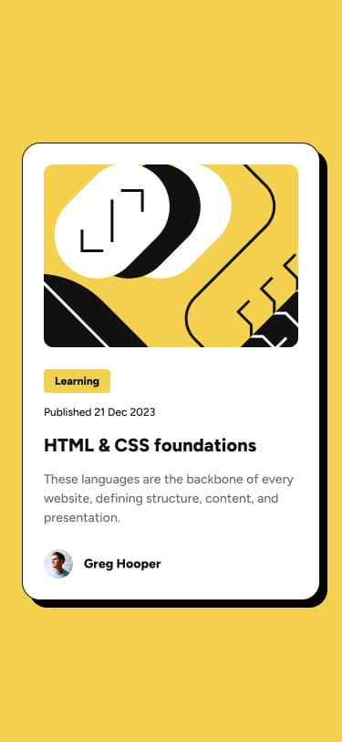

# Frontend Mentor - Blog preview card solution

This is a solution to the [Blog preview card challenge on Frontend Mentor](https://www.frontendmentor.io/challenges/blog-preview-card-ckPaj01IcS). Frontend Mentor challenges help you improve your coding skills by building realistic projects. 

## Table of contents

- [Frontend Mentor - Blog preview card solution](#frontend-mentor---blog-preview-card-solution)
  - [Table of contents](#table-of-contents)
  - [Overview](#overview)
    - [The challenge](#the-challenge)
    - [Screenshot of The References](#screenshot-of-the-references)
    - [Links](#links)
  - [My process](#my-process)
    - [Built with](#built-with)
  - [Author](#author)

## Overview

### The challenge

Users should be able to:

- See hover and focus states for all interactive elements on the page

### Screenshot of The References

<!-- DICA: Substitua o 'caminho_para_o_seu_print.jpg' pela sua imagem e ajuste o width se necessário -->

### Links

- Solution URL: [https://github.com/SamuelAbreu74/blog-preview-card](https://github.com/SamuelAbreu74/blog-preview-card)
- Live Site URL: [https://samuelabreu74.github.io/blog-preview-card/](https://samuelabreu74.github.io/blog-preview-card/)

## My process

### Built with

- Semantic HTML5 markup
- CSS3 - Responsive Style
- Flexbox
- Mobile-first workflow

## Author

- Frontend Mentor - [@SamuelAbreu74](https://www.frontendmentor.io/profile/SamuelAbreu74)
